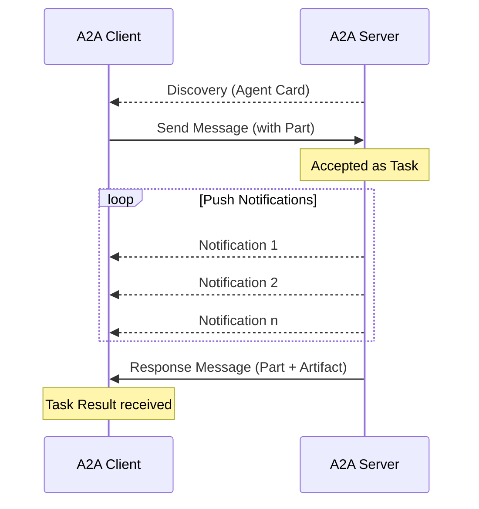

```mermaid
sequenceDiagram
    participant C as A2A Client
    participant S as A2A Server
    
    S-->>C: Discovery (Agent Card)

    C->>S: Send Message (with Part)
    Note over S: Accepted as Task

    loop Push Notifications
        S-->>C: Notification 1
        S-->>C: Notification 2
        S-->>C: Notification n
    end

    S->>C: Response Message (Part + Artifact)
    Note over C: Task Result received
```
